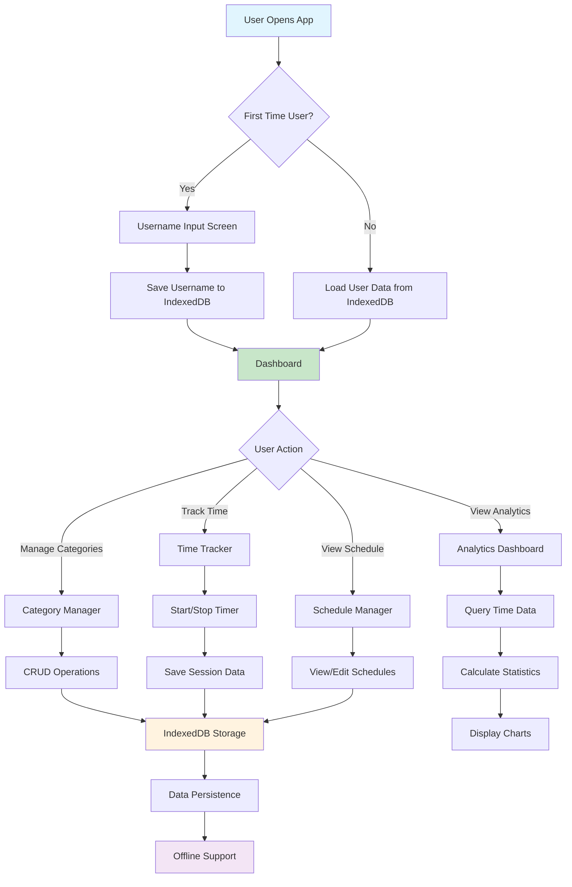
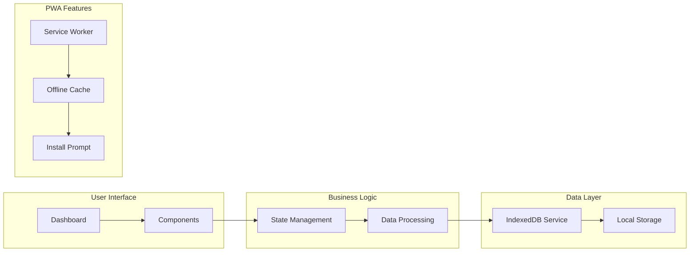
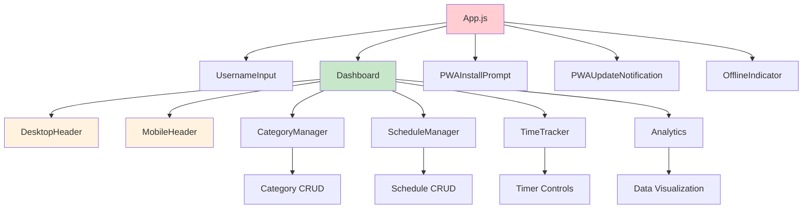
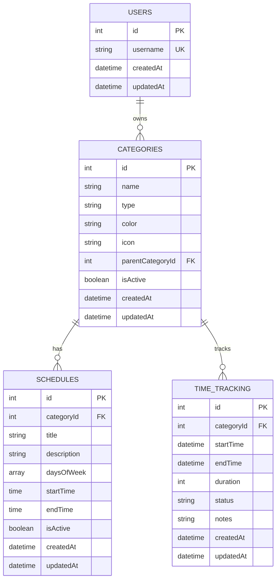
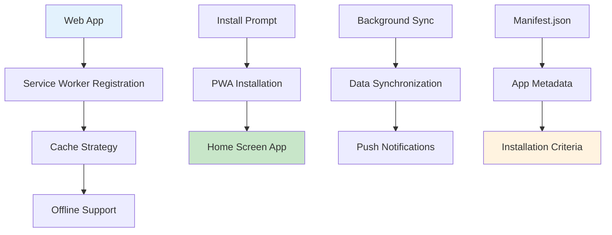
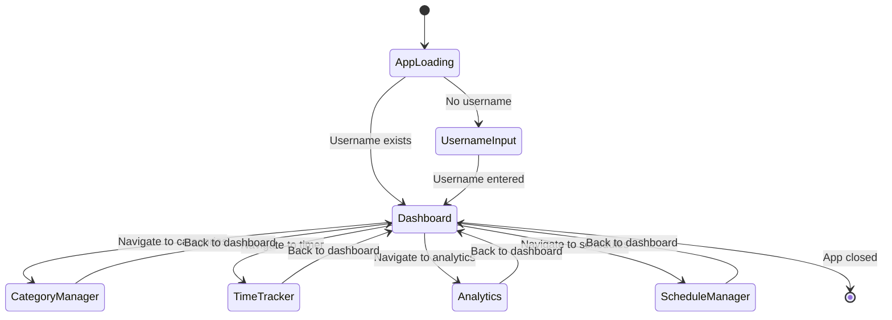
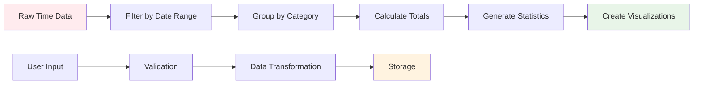

# DailySchedule App Architecture

## 🏗️ Overall App Flow

## 🔄 Data Flow Architecture

## 📱 Component Hierarchy

## 🗄️ Database Schema

## 🚀 PWA Architecture

## 🔐 State Management Flow

## 📊 Data Processing Pipeline

