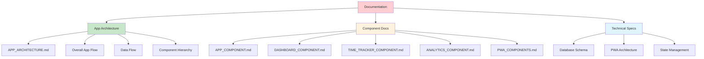
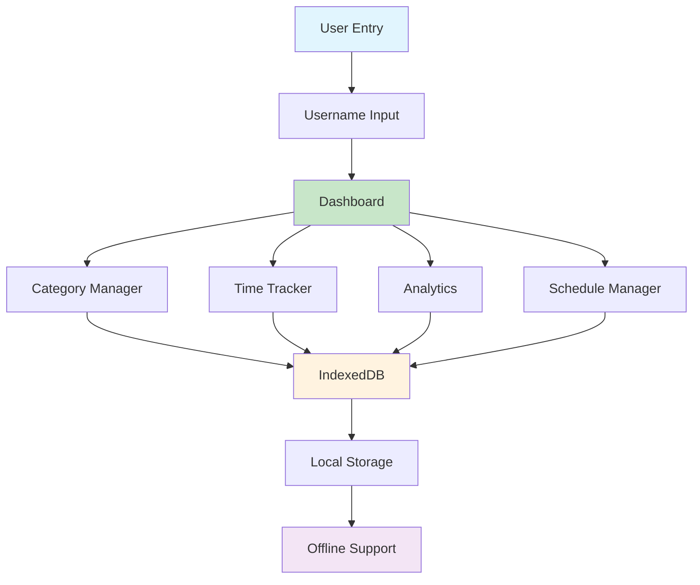
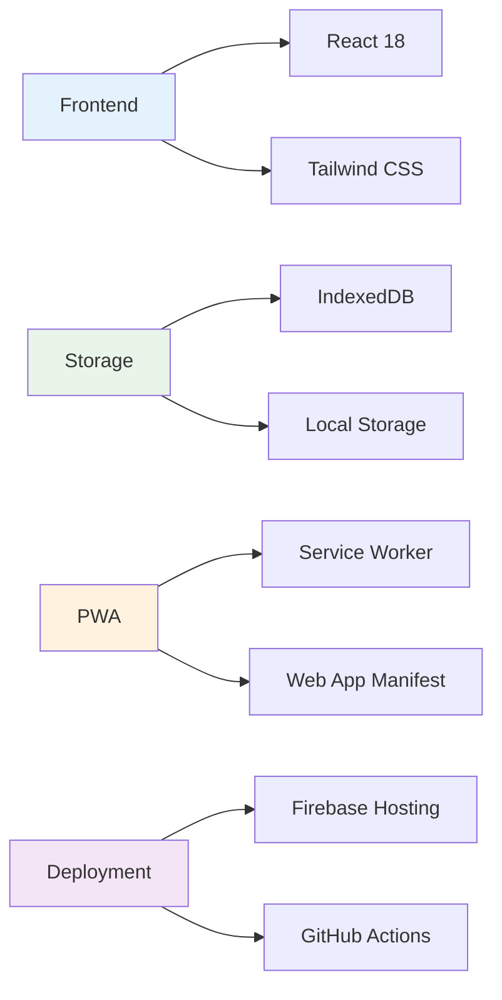
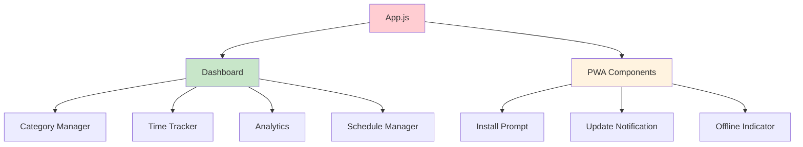

# DailySchedule App Documentation

## 📚 Documentation Overview

This documentation provides comprehensive visual representations and technical details for the DailySchedule Progressive Web App. All diagrams are created using Mermaid.js for clarity and maintainability.

## 🗂️ Documentation Structure

## 🚀 Quick Navigation

### 📱 **Core App Documentation**

- **[App Architecture](APP_ARCHITECTURE.md)** - Complete app overview and flow
- **[App Component](components/APP_COMPONENT.md)** - Main app container documentation

### 🎯 **Feature Components**

- **[Dashboard](components/DASHBOARD_COMPONENT.md)** - Main navigation hub
- **[Time Tracker](components/TIME_TRACKER_COMPONENT.md)** - Time tracking functionality
- **[Analytics](components/ANALYTICS_COMPONENT.md)** - Data visualization and insights

### 🔧 **PWA & Technical**

- **[PWA Components](components/PWA_COMPONENTS.md)** - Progressive Web App features
- **[Firebase Configuration](firebase_datastore.md)** - Hosting and deployment setup

## 🏗️ App Architecture Highlights

## 📊 Key Features Documentation

### ⏱️ **Time Tracking System**

- Real-time timer with pause/resume
- Category-based session management
- Local data persistence
- Session history and analytics

### 📈 **Analytics & Insights**

- Time range filtering (week/month/year)
- Category breakdown with progress bars
- Expandable category trees
- Statistical calculations

### 🏷️ **Category Management**

- Hierarchical category structure
- Main and sub-category organization
- Color coding and icon support
- Predefined productivity categories

### 📱 **PWA Features**

- Install prompt and app installation
- Offline functionality
- Service worker caching
- Update notifications

## 🔧 Technical Stack

## 📱 Component Relationships

## 🎨 Design Principles

- **Mobile-First** - Responsive design for all devices
- **Visual Hierarchy** - Clear information architecture
- **Interactive Elements** - Engaging user experience
- **Performance** - Optimized loading and rendering
- **Accessibility** - Inclusive design patterns

## 📖 How to Use This Documentation

1. **Start with [App Architecture](APP_ARCHITECTURE.md)** for the big picture
2. **Review specific components** based on your needs
3. **Use Mermaid diagrams** to understand flows and relationships
4. **Reference technical specs** for implementation details

## 🔄 Documentation Updates

This documentation is maintained alongside the codebase and includes:

- ✅ Component lifecycle flows
- ✅ State management diagrams
- ✅ Data flow architectures
- ✅ UI layout structures
- ✅ Technical implementation details

## 📞 Support & Contributions

For questions or contributions to the documentation:

- **App URL**: [https://dailyschedule-1a9f7.web.app/](https://dailyschedule-1a9f7.web.app/)
- **Documentation Issues**: Create GitHub issues for improvements
- **Code Contributions**: Follow standard pull request process

---

**📝 Note**: All diagrams use Mermaid.js syntax and will render automatically in GitHub and other Markdown viewers that support Mermaid.
