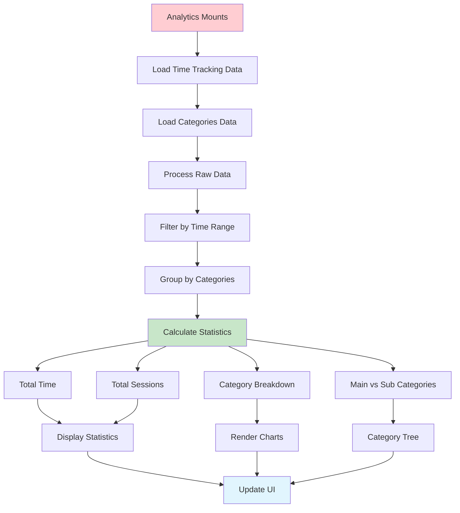
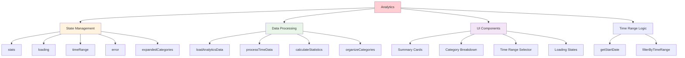
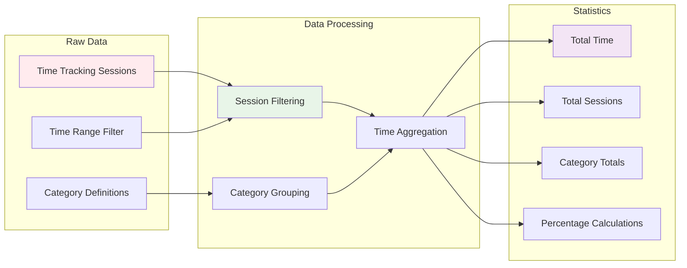
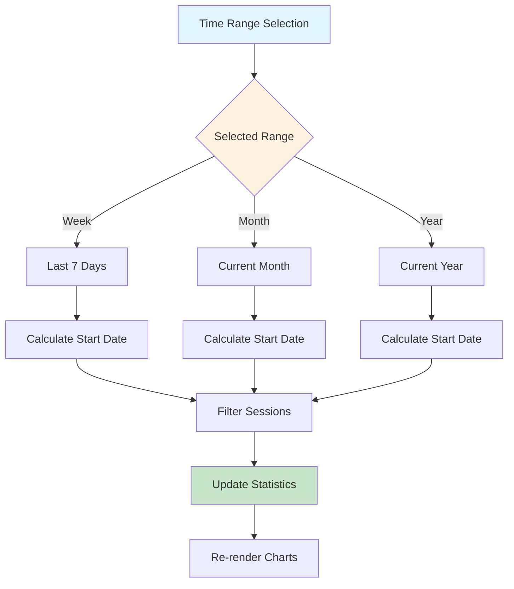
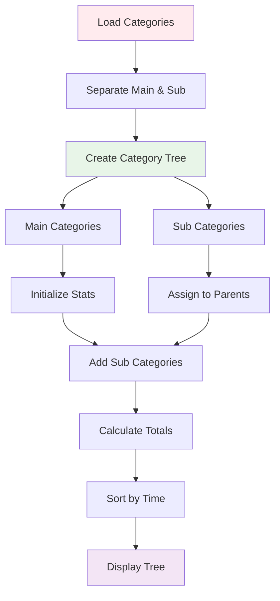
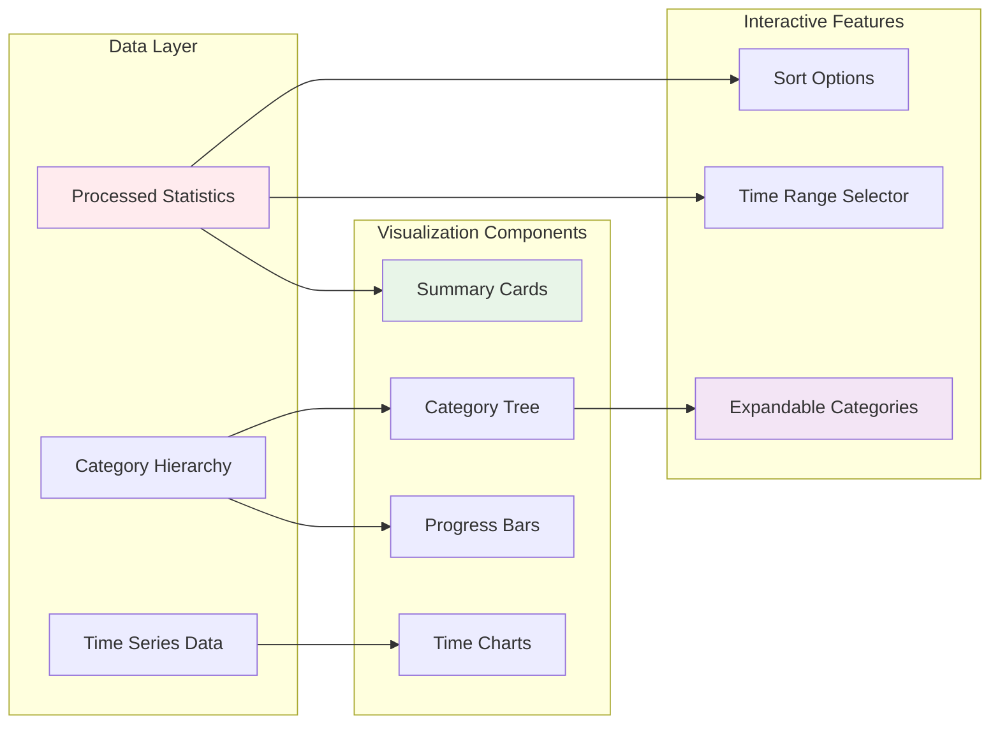
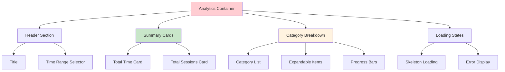
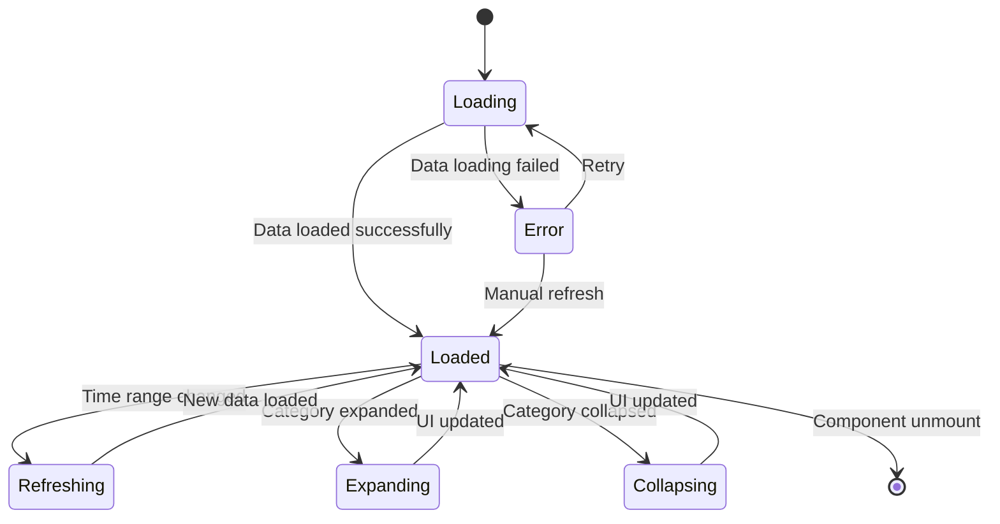
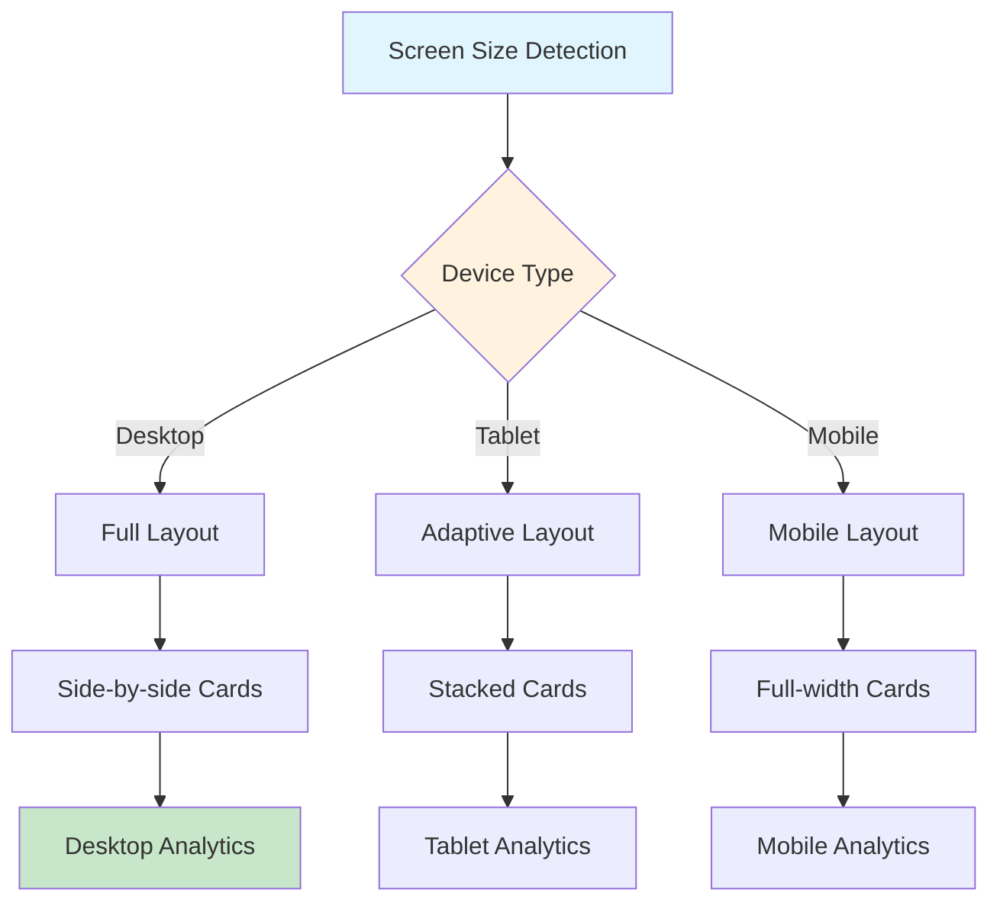

# Analytics Component Documentation

## 🎯 Component Overview

The Analytics component provides comprehensive insights into time tracking data, displaying statistics, charts, and category breakdowns for productivity analysis.

## 📊 Data Processing Flow

## 🏗️ Component Structure

## 📈 Statistics Calculation Flow

## 🕒 Time Range Processing

## 🏷️ Category Organization Flow

## 📊 Data Visualization Architecture

## 🎨 UI Layout Structure

## 🔄 State Management Flow

## 📱 Responsive Design Flow

## 🚀 Key Features

- **Comprehensive Statistics** - Total time, sessions, and category breakdowns
- **Time Range Filtering** - Week, month, and year views
- **Category Hierarchy** - Main and sub-category organization
- **Interactive Charts** - Expandable category trees with progress bars
- **Real-time Updates** - Live data refresh on time range changes
- **Responsive Design** - Optimized for all device sizes
- **Offline Support** - Works with locally stored data

## 🔧 Technical Implementation

- **React Hooks** - useState, useEffect, useCallback, useMemo
- **Data Processing** - Complex aggregation and filtering logic
- **Performance Optimization** - Memoized calculations and rendering
- **IndexedDB Integration** - Local data querying and processing
- **Responsive CSS** - Tailwind CSS with mobile-first approach
- **Error Handling** - Graceful fallbacks and user feedback
- **Loading States** - Skeleton screens and progress indicators
