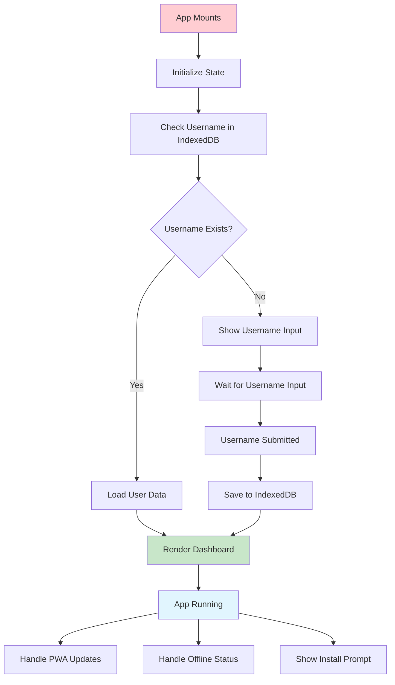
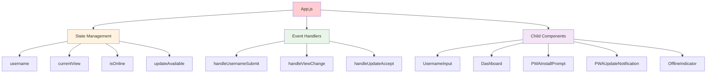
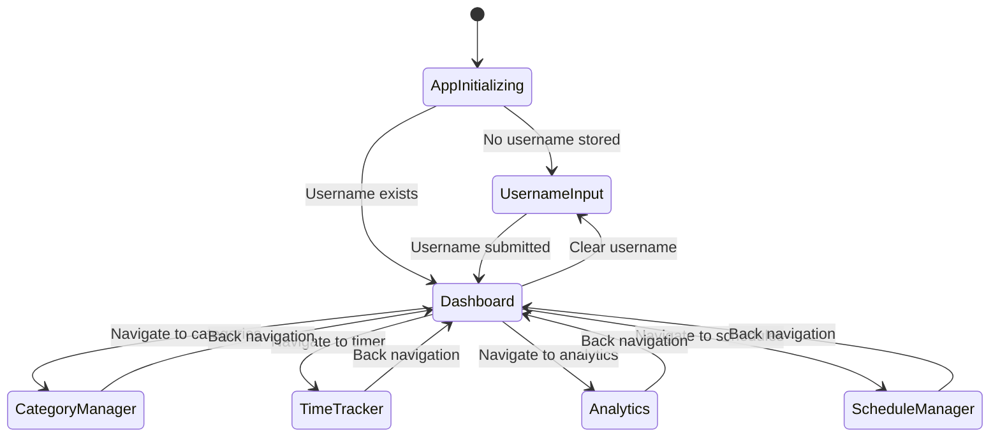
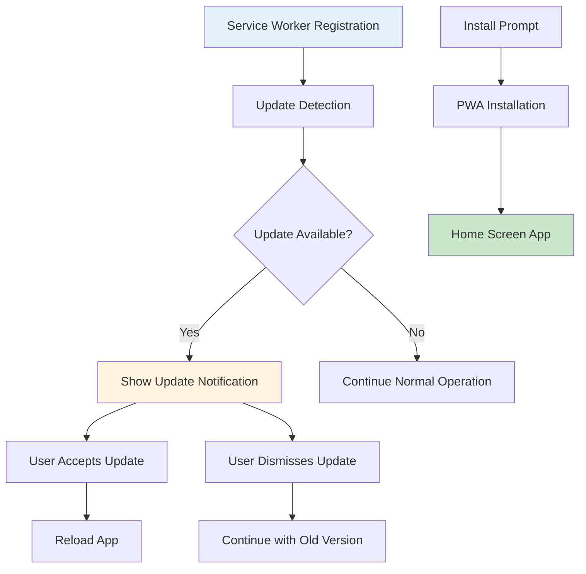
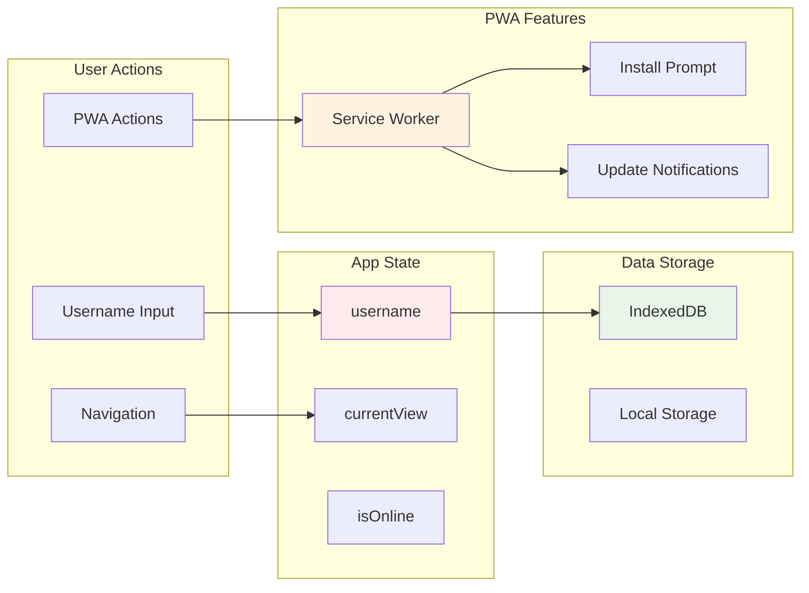
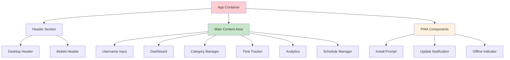

# App.js Component Documentation

## 🎯 Component Overview

The main App component serves as the application's root container, managing global state, routing, and PWA functionality.

## 🔄 Component Lifecycle Flow

## 🏗️ Component Structure

## 🔐 State Management Diagram

## 📱 PWA Integration Flow

## 🔄 Data Flow Architecture

## 🎨 UI Component Layout

## 🚀 Key Features

- **Global State Management** - Centralized app state
- **Navigation Control** - View switching logic
- **PWA Integration** - Service worker and install prompt
- **Offline Detection** - Network status monitoring
- **Update Management** - App update notifications
- **Responsive Design** - Mobile and desktop layouts

## 🔧 Technical Implementation

- **React Hooks** - useState, useEffect for state management
- **IndexedDB Integration** - Local data persistence
- **Service Worker** - PWA functionality
- **Event Listeners** - Network and PWA event handling
- **Component Composition** - Modular component architecture
