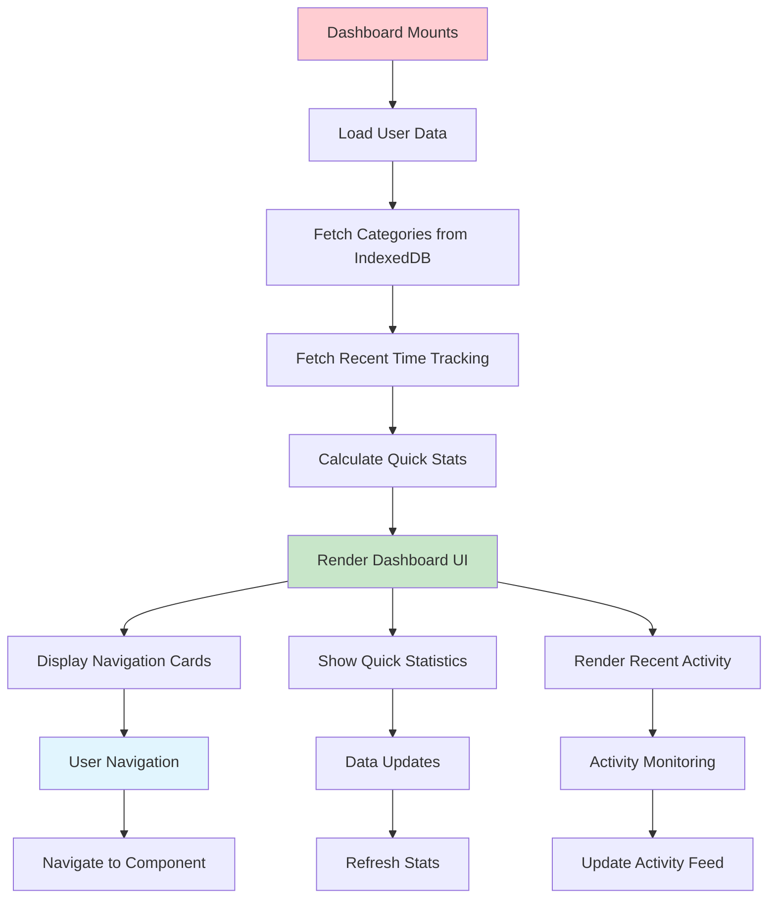
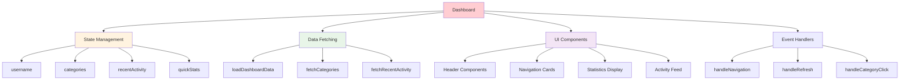
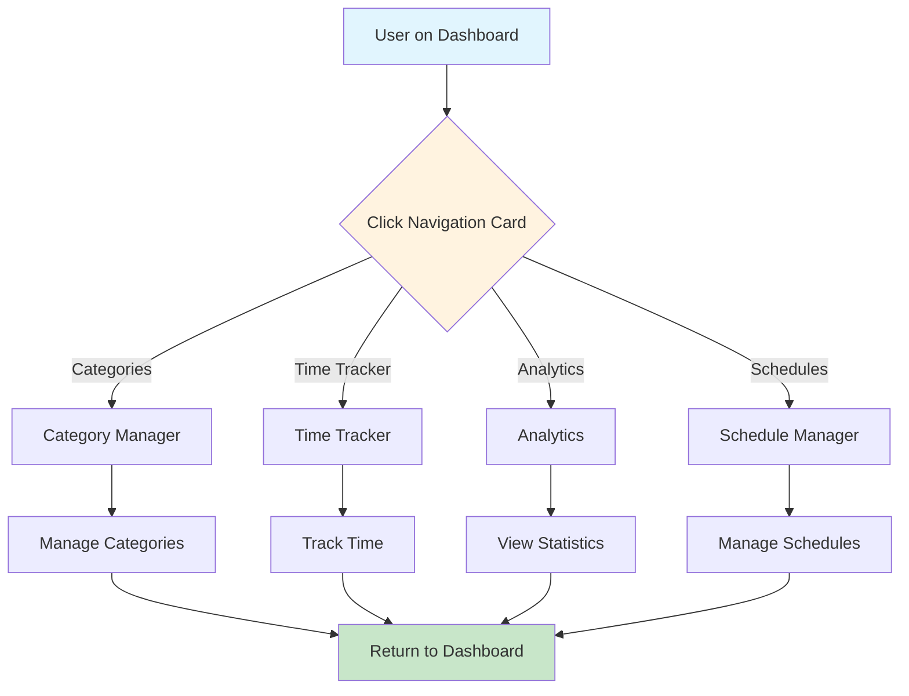
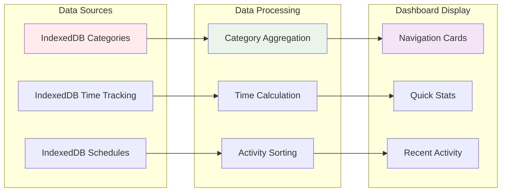
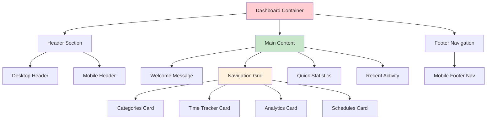
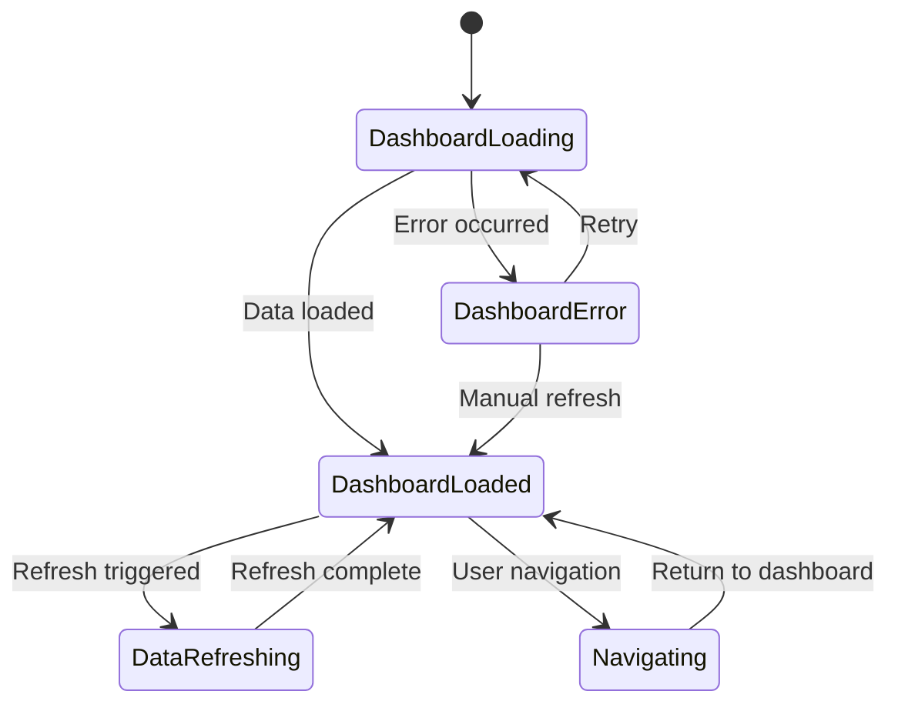
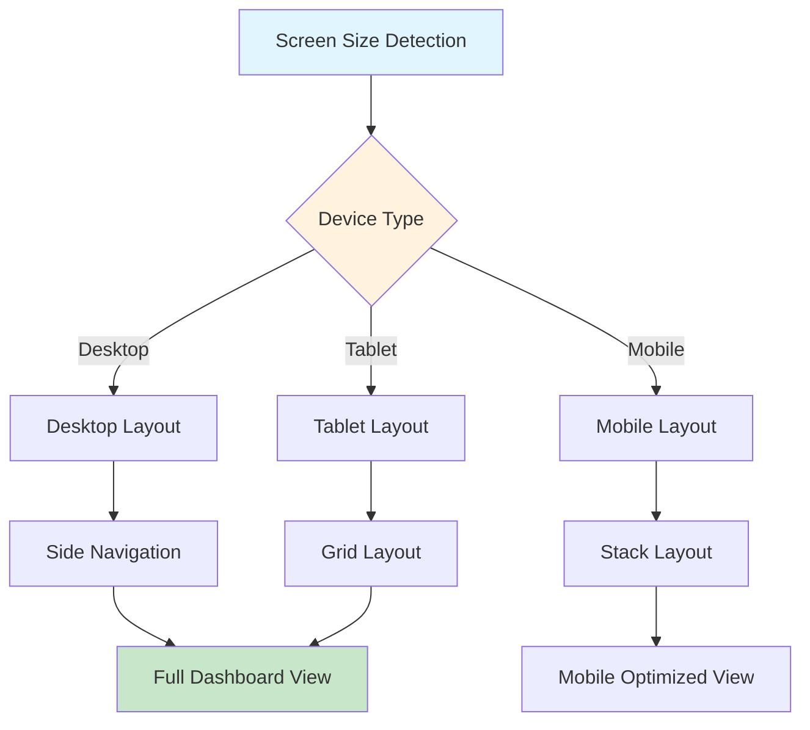

# Dashboard Component Documentation

## 🎯 Component Overview

The Dashboard component serves as the main navigation hub, displaying quick stats and providing access to all app features.

## 🔄 Component Lifecycle Flow

## 🏗️ Component Structure

## 🧭 Navigation Flow

## 📊 Data Loading Architecture

## 🎨 UI Layout Structure

## 🔄 State Management Flow

## 📱 Responsive Design Flow

## 🚀 Key Features

- **Central Navigation Hub** - Access to all app features
- **Quick Statistics** - Overview of user's activity
- **Recent Activity Feed** - Latest time tracking sessions
- **Responsive Design** - Optimized for all device sizes
- **Real-time Updates** - Live data refresh capabilities
- **User Welcome** - Personalized greeting and navigation

## 🔧 Technical Implementation

- **React Hooks** - useState, useEffect, useCallback
- **IndexedDB Integration** - Local data fetching
- **Responsive CSS** - Tailwind CSS with mobile-first approach
- **Component Composition** - Modular UI components
- **Event Handling** - Navigation and data refresh logic
- **Performance Optimization** - Memoized data loading
