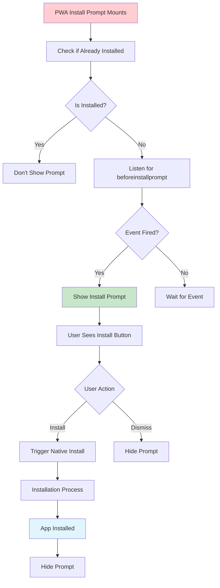
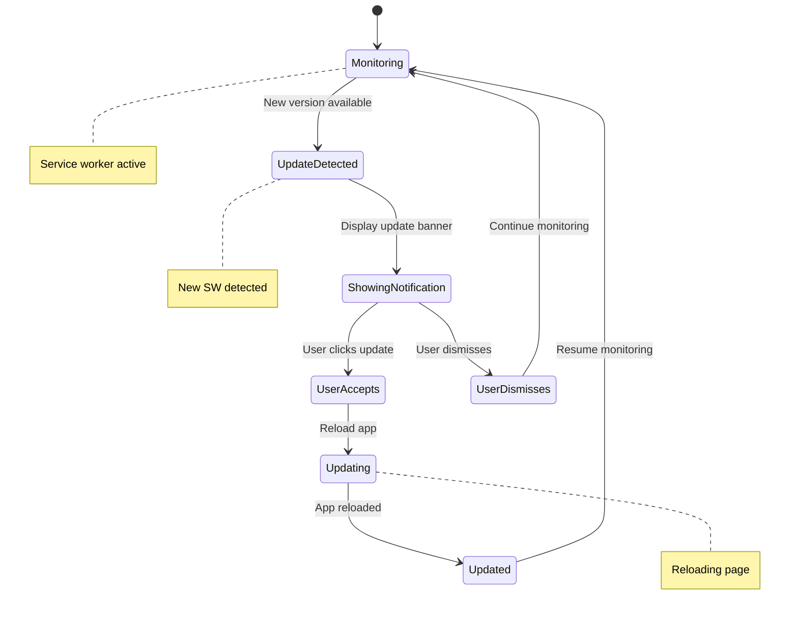
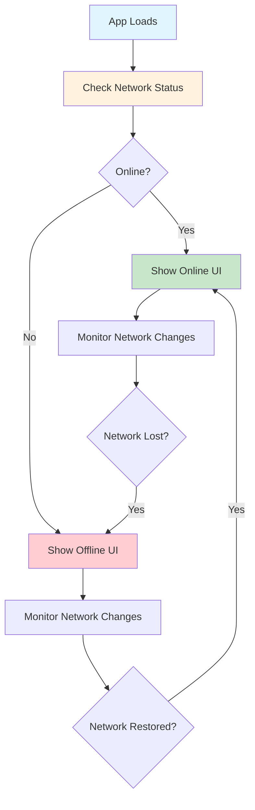
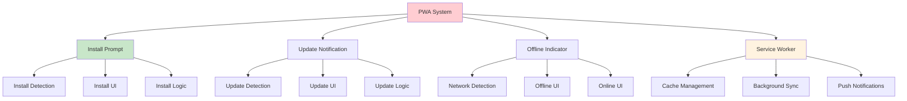
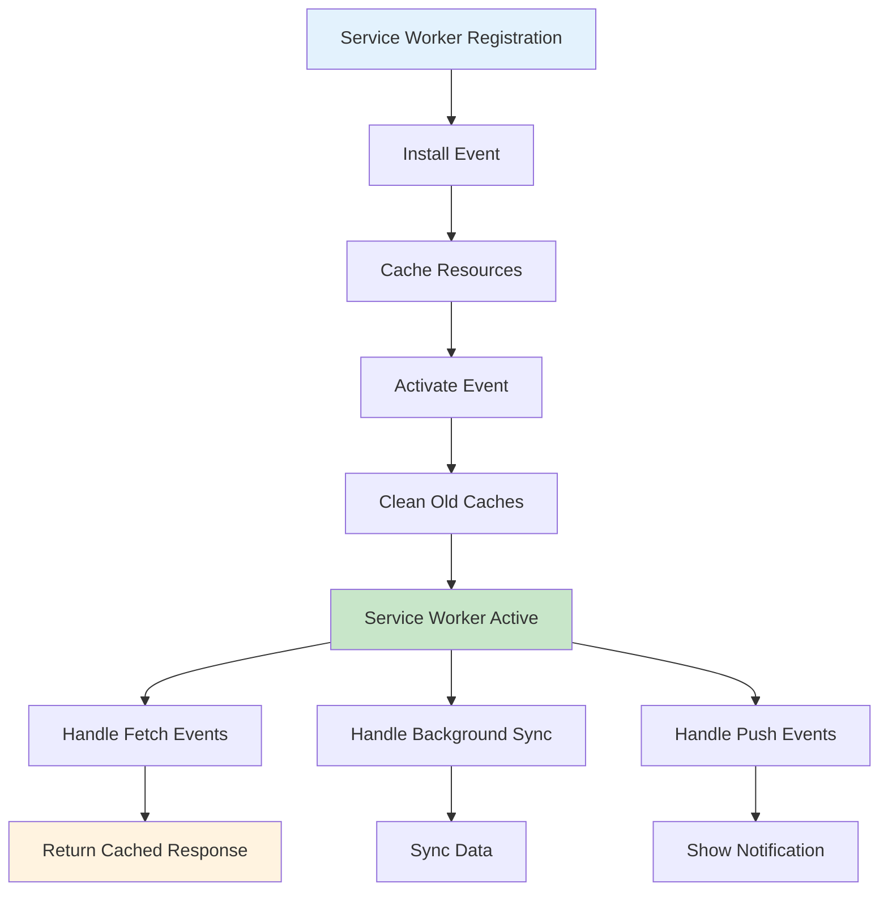
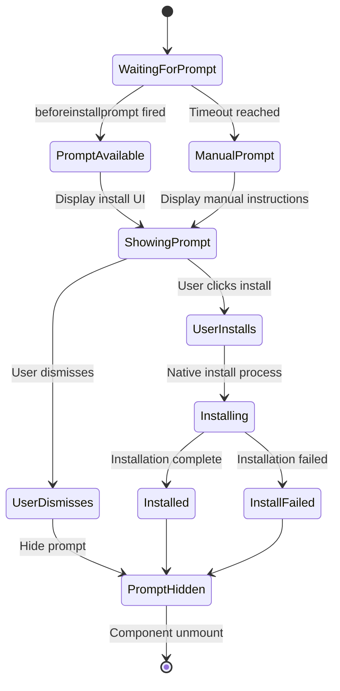
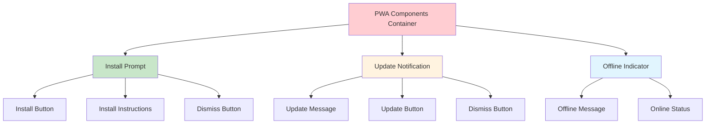
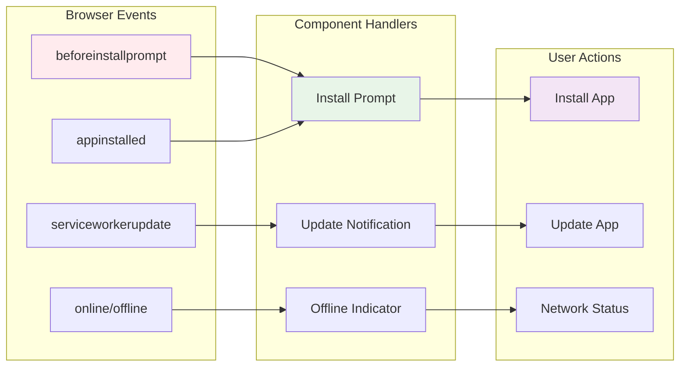
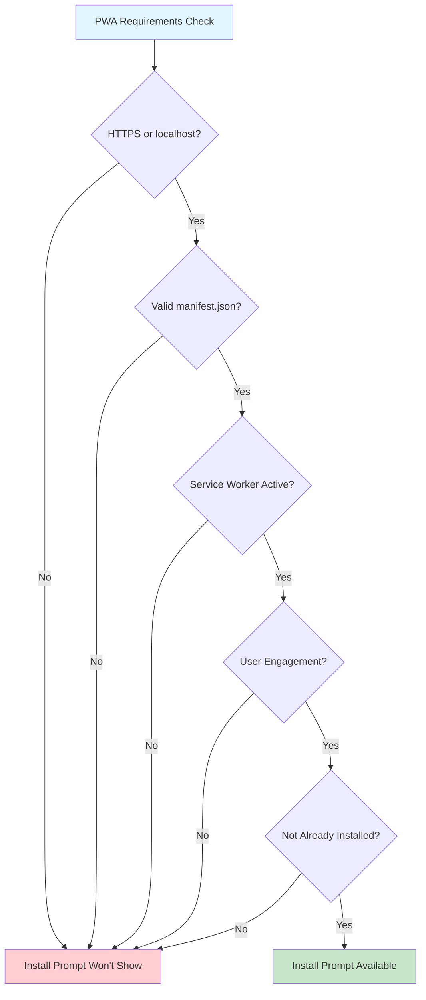

# PWA Components Documentation

## 🎯 Overview

This document covers all Progressive Web App (PWA) components including install prompts, update notifications, and offline indicators.

## 📱 PWA Install Prompt Flow

## 🔄 PWA Update Notification Flow

## 📡 Offline Detection Flow

## 🏗️ PWA Component Architecture

## 🔧 Service Worker Lifecycle

## 📱 Install Prompt State Machine

## 🎨 PWA UI Component Layout

## 🔄 PWA Event Flow

## 📊 PWA Installation Criteria

## 🚀 Key PWA Features

- **Install Prompt** - Automatic app installation detection
- **Update Notifications** - Service worker update alerts
- **Offline Support** - Network status monitoring
- **Service Worker** - Background caching and sync
- **App Manifest** - PWA metadata and configuration
- **Responsive Design** - Mobile-first PWA experience

## 🔧 Technical Implementation

- **Event Listeners** - beforeinstallprompt, appinstalled, online/offline
- **Service Worker** - Cache strategies and background sync
- **State Management** - Complex PWA state handling
- **User Experience** - Smooth install and update flows
- **Error Handling** - Graceful fallbacks for unsupported browsers
- **Performance** - Optimized PWA loading and caching
