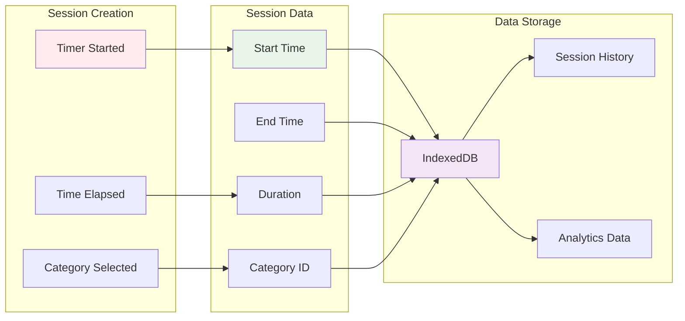

# TimeTracker Component Documentation

## 🎯 Component Overview

The TimeTracker component manages time tracking functionality, allowing users to start, stop, and manage time tracking sessions for different categories.

## ⏱️ Timer State Flow

## 🔄 Component Lifecycle Flow

## 🏗️ Component Structure

## ⏰ Timer Control Flow

## 📊 Session Management Flow

## 🎨 UI Layout Structure

## 🔄 Data Flow Architecture

## 📱 Mobile Optimization Flow

## 🚀 Key Features

- **Real-time Timer** - Live countdown with millisecond precision
- **Category Selection** - Choose activity category before starting
- **Session Management** - Start, pause, resume, and stop tracking
- **Data Persistence** - Save sessions to IndexedDB
- **Session History** - View and manage past tracking sessions
- **Responsive Design** - Optimized for all device sizes
- **Offline Support** - Works without internet connection

## 🔧 Technical Implementation

- **React Hooks** - useState, useEffect, useCallback, useInterval
- **Timer Logic** - Custom interval management for accurate timing
- **State Management** - Complex timer state handling
- **IndexedDB Integration** - Local session storage
- **Event Handling** - User interaction and timer controls
- **Performance Optimization** - Efficient re-renders and updates
- **Mobile-First Design** - Responsive CSS with Tailwind
